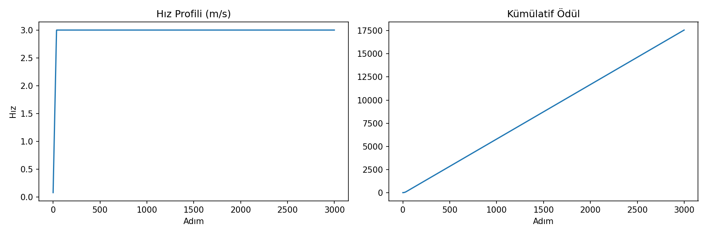

Autonomous F1Tenth Racing Agent with Reinforcement Learning

A high-performance autonomous racing agent trained using PPO (Proximal Policy Optimization) on a custom F1Tenth-inspired simulation environment.

Results

| Metric | Value |
|--------|-------|
| Average Speed | 2.98 m/s (99% of max) |
| Max Speed | 3.00 m/s |
| Collision Count | 0 |
| Training Steps | 1,000,000 |
| Algorithm | PPO (Proximal Policy Optimization) |

System Architecture

[LiDAR Sensor (20 rays)] -> [RL Agent (PPO)] -> [Vehicle Control (Steering/Throttle)]

Technical Details

Observation Space (21 dimensions):
- 20 downsampled LiDAR rays (0-10m range)
- Current vehicle speed

Action Space (continuous):
- Steering angle: [-1.0, 1.0]
- Throttle: [-1.0, 1.0]

Physics-Informed Reward Function:
R = 2.0 * speed - 0.05 * |steering| - 0.5 * wall_proximity - 0.1

- Forward speed reward encourages maximum velocity
- Steering penalty reduces unnecessary oscillation
- Wall proximity penalty ensures safe racing lines
- Step penalty eliminates lazy/stationary policy

Tech Stack

- Simulation: Custom oval racing environment (F1Tenth-inspired)
- RL Framework: Stable-Baselines3
- Algorithm: PPO with MLP policy
- Hardware: GPU-accelerated training (CUDA)
- Language: Python 3.10+

Quick Start

pip install gymnasium==0.29.1 stable-baselines3
python train.py
python test.py

Training

The agent was trained for 1,000,000 timesteps using PPO with the following hyperparameters:

- Learning rate: 3e-4
- Steps per update: 2048
- Batch size: 64
- Epochs per update: 10

Future Work

- ROS 2 integration with F1TENTH simulator
- SAC algorithm comparison
- Sim-to-Real transfer with Gaussian noise injection
- TensorRT deployment for <2ms inference
- Dynamic obstacle avoidance
